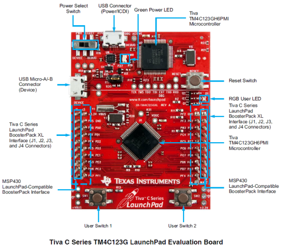
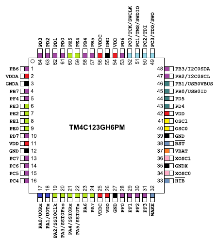
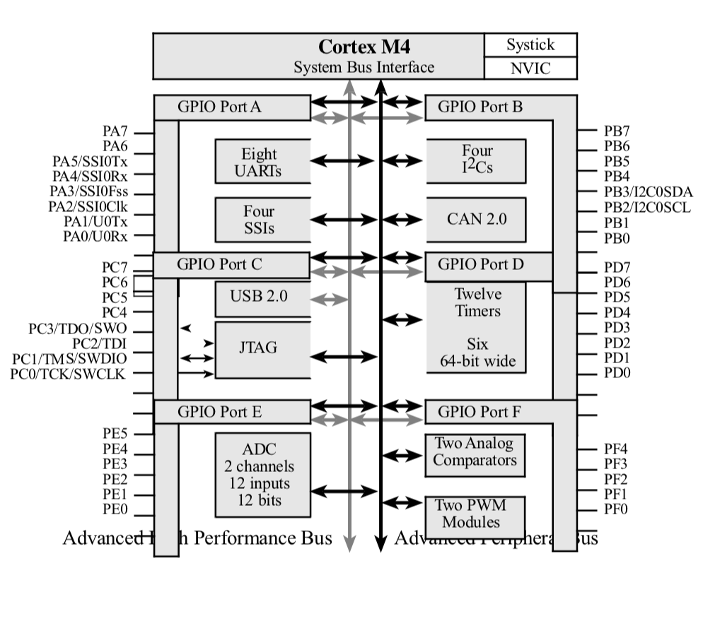
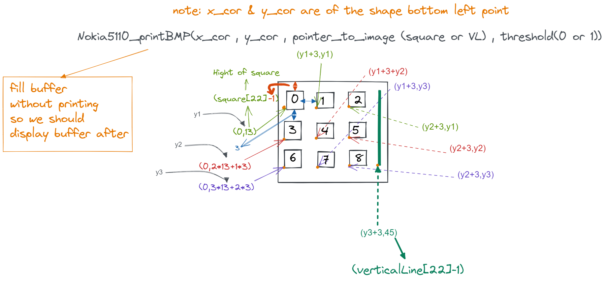

#                                       XO Game

In this project we are going to deploy the famous XO game aka "tic tac toe" using the well-known microcontroller (**tm4c123gh6pm**) **Tiva-C LaunchPad**. So firstly we need to be familiar with this type of microcontroller.

The TM4C123G is a member of the class of high performance 32 bit ARM cortex M4 microcontroller with a broad set of peripherals developed by Texas Instrumentals. The TIVA launchpad has a built-in processor clock frequency of up to 80MHz with a floating-point unit (FPU). The Cortex-M4F processor also supports the tail chaining functionality. It also includes a nested vector interrupt controller (NVIC). The debugging interface used is JTAG and SWD (serial wire debugger) for programming and debugging purposes.




Without GPIOs we won’t have any other way to use a microcontroller and it will be nothing more different than a chunk of well-fabricated silicon. Through them we can interface both transducers or sensors and actuators. We can also connect other devices like a display, external devices and so on.The GPIOs of TM4C123 Tiva C ARM microcontrollers are very elaborate, having many options that are usually unavailable in common 8-bit microcontrollers and below we are providing a diagram for more ease in understanding it.

 


For more understanding of this microcontroller programming please check the [recourses]() section where you will find the detailed datasheets and tutorials that will be of great advantage for any one starting in this field.

> To Simulate the output of this program you can use KEIL software and go through this [tutorial](https://users.ece.utexas.edu/~valvano/edX/download.html) for installation.

## Software Specifications

The project code consists of drivers files for GPIO, Timers, Interrupts, and handlers for the game functionality.

The following is an example of GPIO driver with an initialized interrupt and the handler function:

```c
void PortF_Init(void)
{
 
  	SYSCTL_RCGC2_R |= 0x00000020;   // 1) F clock
  	delay = SYSCTL_RCGC2_R;         // delay
  	GPIO_PORTF_LOCK_R = 0x4C4F434B; // 2) unlock PortF PF0
 	GPIO_PORTF_CR_R = 0x1F;         // allow changes to PF4-0
	GPIO_PORTF_LOCK_R = 0;            
  	GPIO_PORTF_AFSEL_R = 0x00;      // 6) no alternate function
	GPIO_PORTF_PCTL_R = 0x00000000; // 4) GPIO clear bit PCTL
	GPIO_PORTF_AMSEL_R = 0x00;      // 3) disable analog function
  	GPIO_PORTF_DIR_R = 0x0E;        // 5) PF4,PF0 input, PF3,PF2,PF1 output
  	GPIO_PORTF_PUR_R = 0x11;        // enable pullup resistors on PF4,PF0
  	GPIO_PORTF_DEN_R = 0x1F;        // 7) enable digital pins PF4-PF0
	GPIO_PORTF_IS_R &= 0x00;     	  // (d) PF4, PF0 are edge-sensitive
	GPIO_PORTF_IBE_R &= 0x00;			  // PF4, PF0 are not both edges
  	GPIO_PORTF_IEV_R |= 0x11;    	  // PF4, Pf0 are rising edge event
  	GPIO_PORTF_ICR_R = 0x11;      						// (e) Clear flag4, flag0
  	GPIO_PORTF_IM_R |= 0x11;      						// (f) Arm interrupt on PF4, PF0
	NVIC_PRI7_R = (NVIC_PRI7_R & 0xff00ffff)|0x00A00000;
	NVIC_EN0_R = 0x40000000;
	EnableInterrupts();
}

```

Also There are header files for most of the drivers for a more architect code implementation.

Here is an example of these files:

```c
/*******************************************************************************
 *                      Functions Prototypes                                    *
 *******************************************************************************/

/* Function for time delay in 0.1 seconds */
void Delay100ms(unsigned long count);

/*Function to enter to the game */
void GameIntro(void);

/*Function for reset game "start again" */
void GameInitialization(void);

/*Function for play xo game */
void RunGame(void);

/*Function for know the winner of xo game */
int checkWinner(char player);

/*Function for display the winner of xo game */
void Display_Winner(char player);

/*Function for  draw the xo shape */
void displayDraw(void);

/*Function for  display who play now*/
void displayStatus(void);

/*Function for check the replay of xo game */
int CheckPlayAgain(void);

/*Function to End xo game */
void EndGame(void);

/*Function for clear data */
void DrawClearGameMatrix(void);
```

## Required Hardware I/O connections

For the Ease of use we have developed this project to work on the simulator without any need of external hardware and also in a way that is compatible with using external hardware.

In case of using hardware here is a list of needed components:

- Tiva C LaunchPad
- Nokia5110 Screen (Blue)
- 2 switches
- 3 RGB Leds
- Male-Female Jumbers (connectors)
- 470 ohm, 10k Resistors
- Breadboard

##### Blue Nokia 5110 Connections

| Signal       | (Nokia 5110) LaunchPad pin                                   |
| ------------ | ------------------------------------------------------------ |
| Reset        | (RST, pin 1) connected to PA7                                |
| SSI0Fss      | (CE,  pin 2) connected to PA3                                |
| Data/Command | (DC,  pin 3) connected to PA6                                |
| SSI0Tx       | (Din, pin 4) connected to PA5                                |
| SSI0Clk      | (Clk, pin 5) connected to PA2                                |
| 3.3V         | (Vcc, pin 6) power                                           |
| back light   | (BL,  pin 7) not connected, consists of 4 white LEDs which draw ~80mA total |
| Ground       | (Gnd, pin 8) ground                                          |

##### Screen Dimensioning



In The above illustration we are presenting how are graphics and arts displayed on Nokia 5110 Screen.

As you can notice the screen is 84x48 pixels in dimension and every pixel can be turned on or off according to the programmed output to the screen. So we created a matrix of square-shaped arts, each of (**14px height * 14px width**) to display the XO matrix.   

## Output Simulation

**To Run this project on the simulator follow these steps:**

1. Download the repository
   on Linux:

   ```bash
   git clone https://github.com/Ola-Mohamed/-XO-game-on-Nokia5110.git
   ```

   or use the download button on GitHub

2. Open the downloaded folder and search for a file with name `XO Game.uvproj` and open it. This will open up the simulator and load the source code files on it.

3. On the top left corner you will find a button called `Rebuild` click on it and make sure there are no errors as in images, This will build all target files and load all drivers and headers.

   

4. click on the `options for target` and make sure you are on the debug tab and choosing `Use Simulator`and make the same configurations as in following images.

   

5. Now click on the `debug` button which will open a new window. From the top bar in this window choose `Peripherals` and select `TExas Nokia` and `TExas Port F` and now you are ready to make magic and defeat your self in XO Game, Only one thing is left ... 

   

6. Click on the `run` button from the `debug` menu and watch the magic happens

> below are screenshots from the program while running

 

 


**To Run this project on External Hardware follow the same steps as before exept for**

* step 4: check the box next to `Use Stellaric lcdl` instead of choosing `Use Simulator`. 

* Then Click on `Load` button to download the code to the kit 

  

* step 5: you don't need the peripherals this time you just go and click on `run` and voila ....

> **A full simulation along with hardware connections can be found in the following Video** 
>
> > Video goes here ................

## Team Members

This Project was created due to the efforts of all the team members and their indescribable hard work.

<table>
  <tr>
    <td align="center"><a href="https://github.com/BU9D4DDY"><br /><sub><b>Diaa Eldein Hassan</b></sub></a><br /></td>
    <td align="center"><a href="https://github.com/Red-Cloud2000"><br /><sub><b>Abdelrahman Hesham</b></sub></a><br /></td>
    <td align="center"><a href="https://github.com/Ola-Mohamed"><br /><sub><b>Ola Mohamed Ahmed</b></sub></a><br /></td>
    <td align="center"><a href="https://github.com/ahmedokka29"><br /><sub><b>Ahmed Gamal Mostafa</b></sub></a><br /></td>
    <td align="center"><a href="https://github.com/RamziMohamad"><br /><sub><b>Ramzi Mohamed</b></sub></a><br /></td>
    <td align="center"><a href="https://github.com/Abdelrahman-Atef-Elsayed"><br /><sub><b>Abdelrahman Atef</b></sub></a><br /></td>
    </tr>
</table>

## Resources

* Datasheet link: [Download](https://www.ti.com/lit/ds/symlink/tm4c123gh6pm.pdf)
* KEIL Simulator Software [Go Here](https://www.keil.com/download/)
* Tutorials
  * [Embedded Systems - Shape The World Book](http://users.ece.utexas.edu/~valvano/Volume1/E-Book/)
  * [Embedded Software in C for an ARM Cortex M](http://users.ece.utexas.edu/~valvano/embed/toc1.htm)
  * [ARM Microcontroller Programming With the TI Stellaris/Tiva-C Board(s)](https://www.youtube.com/watch?v=OnW2njOgA7g&list=PLmfT_cdP5PYBWYvK_bCdGyBqQEiRzUPeq)
  * [Embedded System Course 2015 - Arabic](https://www.youtube.com/watch?v=j5mr_0omLCQ&list=PLikkRSgdfjuqlPKfQkPm4FeB9QT8dPojw)
  * [Microcontroller and Interface](https://www.youtube.com/watch?v=RVEW1gBpnyk&list=PLR9Db0Xmncr2DJfKxzA76ih8vJsy2tE52)
